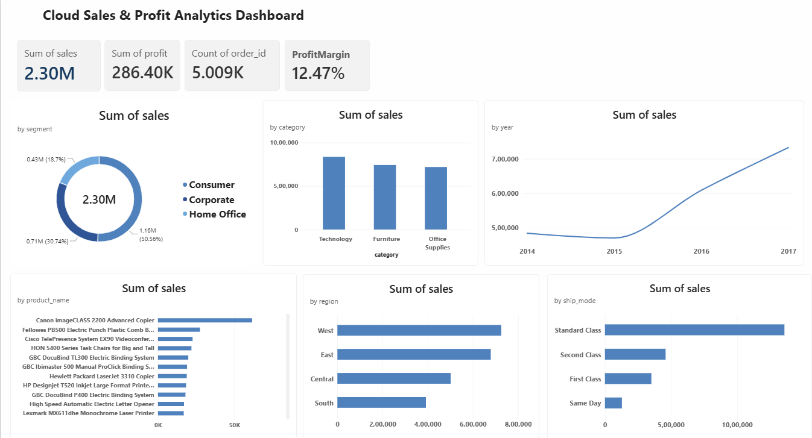

# Cloud Data Engineering & Analytics Platform

An end-to-end data engineering and analytics project that transforms raw retail data into a structured MySQL data warehouse and visualizes business insights through an interactive Power BI dashboard.

## Project Overview

This project demonstrates a complete data pipeline:

**Raw CSV Data → Python ETL → MySQL Data Warehouse → Power BI Dashboard**

The pipeline ingests retail sales data, cleans and transforms it using Python and Pandas, loads it into a dimensional data model in MySQL, and presents key business insights through Power BI.

## Architecture

```text
┌─────────────────────┐
│   Raw CSV Dataset   │
│   Superstore Data   │
└──────────┬──────────┘
           │
           ▼
┌─────────────────────┐
│    Python + Pandas  │
│    ETL Pipeline     │
│                     │
│ • Data Cleaning     │
│ • Transformation    │
│ • Validation        │
└──────────┬──────────┘
           │
           ▼
┌─────────────────────┐
│   MySQL Data        │
│   Warehouse         │
│                     │
│ • dim_customer      │
│ • dim_product       │
│ • dim_location      │
│ • dim_date          │
│ • fact_sales        │
└──────────┬──────────┘
           │
           ▼
┌─────────────────────┐
│   Power BI          │
│   Analytics         │
│   Dashboard         │
└─────────────────────┘
```

## Project Features

* End-to-end ETL pipeline built with Python
* Data transformation and cleaning using Pandas
* MySQL dimensional data warehouse
* Star schema data model
* Customer, product, location, and date dimensions
* Sales fact table with 9,994 records
* Automated dimension loading
* Foreign key relationships between dimensions and fact data
* Power BI dashboard for business analytics
* Docker configuration for containerized deployment

## Data Warehouse Design

The project uses a dimensional model consisting of:

### Dimension Tables

| Table          | Description                                          |
| -------------- | ---------------------------------------------------- |
| `dim_customer` | Customer information and segments                    |
| `dim_product`  | Product, category, and sub-category details          |
| `dim_location` | Geographic and regional information                  |
| `dim_date`     | Date, year, quarter, month, week, and day attributes |

### Fact Table

| Table        | Description                                                        |
| ------------ | ------------------------------------------------------------------ |
| `fact_sales` | Sales transactions including quantity, sales, discount, and profit |

## ETL Pipeline

The ETL pipeline performs the following steps:

1. Reads the raw Superstore CSV dataset.
2. Standardizes column names.
3. Converts date fields into proper datetime values.
4. Cleans numeric fields such as sales, profit, discount, quantity, and postal code.
5. Loads customer dimension data.
6. Loads product dimension data.
7. Loads location dimension data.
8. Generates and loads the date dimension.
9. Maps dimension surrogate keys.
10. Loads 9,994 records into the `fact_sales` table.

### ETL Results

```text
Rows loaded: 9994
Clean rows: 9994
Customers loaded: 793
Products loaded: 1894
Locations loaded: 632
Dates loaded: 1237
Sales rows loaded: 9994

ETL PIPELINE COMPLETED SUCCESSFULLY
```

## Power BI Dashboard

The Power BI dashboard provides an overview of key business metrics and sales performance.

### Key KPIs

* Total Sales
* Total Profit
* Profit Margin
* Sales by Category
* Sales by Region
* Sales by Segment
* Sales by Ship Mode
* Sales by Product
* Sales Trends by Year

### Dashboard Preview



## Project Structure

```text
cloud-data-engineering-platform/
│
├── data/
│   └── raw/
│       └── Superstore.csv
│
├── powerbi/
│   └── Cloud_Analytics_Dashboard.pbix
│
├── screenshots/
│   └── cloud-analytics-dashboard.png
│
├── sql/
│   ├── schema.sql
│   └── analytics.sql
│
├── src/
│   └── etl/
│       ├── ingest.py
│       ├── transform.py
│       └── load.py
│
├── tests/
│
├── Dockerfile
├── docker-compose.yml
├── requirements.txt
└── README.md
```

## Technologies Used

* Python
* Pandas
* MySQL
* SQL
* Power BI
* Docker
* Docker Compose
* Git
* GitHub
* Linux / WSL

## How to Run the Project

### 1. Clone the repository

```bash
git clone https://github.com/kavana-06/cloud-data-engineering-platform.git
cd cloud-data-engineering-platform
```

### 2. Create and activate a virtual environment

```bash
python3 -m venv .venv
source .venv/bin/activate
```

### 3. Install dependencies

```bash
pip install -r requirements.txt
```

### 4. Configure environment variables

Create a `.env` file:

```env
MYSQL_HOST=localhost
MYSQL_PORT=3306
MYSQL_USER=your_mysql_user
MYSQL_PASSWORD=your_mysql_password
MYSQL_DATABASE=cloud_analytics
```

### 5. Create the database schema

```bash
mysql -u your_mysql_user -p < sql/schema.sql
```

### 6. Run the ETL pipeline

```bash
python -m src.etl.load
```

## Key Outcomes

* Built a complete ETL pipeline from raw data to analytics.
* Designed a dimensional MySQL data warehouse.
* Loaded and modeled 9,994 sales transactions.
* Created reusable customer, product, location, and date dimensions.
* Developed an interactive Power BI business dashboard.
* Containerized the project environment with Docker configuration.

## Future Improvements

* Add automated data quality tests.
* Add logging and error monitoring.
* Schedule ETL jobs.
* Deploy the pipeline to a cloud platform.
* Add CI/CD using GitHub Actions.
* Integrate cloud data storage and orchestration.

---

**Built by Kavana**
Focused on Cloud Computing, DevOps, Data Engineering, and Analytics.
